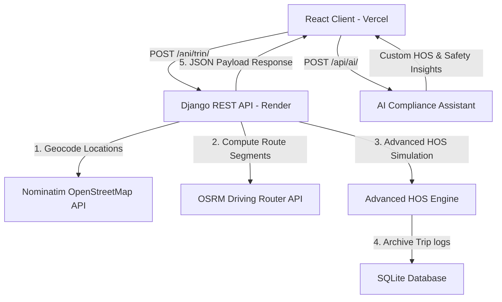

# Smart Truck ELD & Fleet Compliance Planner 🚛💨

A high-fidelity, portfolio-grade Full-stack Truck ELD and Fleet Compliance Planner application. This system integrates real-time geocoding, OSRM routing, FMCSA hours of service (HOS) simulations, visual daily electronic logs (ELD), operating cost calculators, and an interactive AI compliance assistant.

---

## 🔗 Live Submission Links

* **Live Hosted Application (Vercel):** [https://truck-eld-planner.vercel.app](https://truck-eld-planner.vercel.app)
* **Loom Video Walkthrough:** [https://www.loom.com/share/0420089016104a6e81264418d5816662](https://www.loom.com/share/0420089016104a6e81264418d5816662)
* **GitHub Repository:** [https://github.com/VimalN2005/truck-eld-planner](https://github.com/VimalN2005/truck-eld-planner)

---

## 🛠️ System Architecture

The application is structured as a decoupled Full-Stack system:
* **Frontend:** Single Page Application (SPA) built using React (Vite) and styled with clean, responsive vanilla CSS. Interactive map overlays are drawn using Leaflet.
* **Backend:** REST API built using Django and Django REST Framework, connecting to a local SQLite database for session authentication and trip histories.



---

## 🌟 Core Features

### 1. Dynamic Route Mapping & Geocoding
* Resolves coordinates for Current, Pickup, and Dropoff endpoints using the Nominatim OpenStreetMap API.
* Fetches detailed route geometry via the OSRM (Open Source Routing Machine) engine.
* Renders the route legs on a Leaflet map in distinct colors: **Blue** for the Current $\rightarrow$ Pickup leg, and **Emerald Green** for the Pickup $\rightarrow$ Dropoff transit leg.

### 2. FMCSA Compliant HOS Engine
Simulates daily logs on a 24-hour scale enforcing real-world limits:
* **11-Hour Driving Limit** & **14-Hour Shift Duty Window** restrictions.
* **30-Minute Rest Break** automatically scheduled after 8 hours of driving.
* **10-Hour Consecutive Off-Duty Rest** required between daily shifts.
* **70-Hour / 8-Day Rolling Cycle Limit** checks that automatically insert a **34-hour off-duty restart** day if weekly hours run out.
* **Assessment Rules:** Models a **1-hour stop** at the pickup loading point, a **1-hour stop** at dropoff unloading, and a **30-minute fueling stop** once cumulative driving distance exceeds 1,000 miles.

### 3. Visual ELD Daily Log Sheet
* **SVG Log Grid:** Dynamically draws the standard paper log sheet grid showing a green status line mapping Off Duty, Sleeper Berth, Driving, and On Duty segments for each day of the journey.
* **Remarks Timeline:** Lists a time-stamped log of status updates (inspections, route transitions, breaks, rest releases).
* **70h Cycle Recap:** Renders today's duty time, rolling 7-day cumulative hours, and remaining balance for tomorrow.

### 4. Fleet Financial Cost Estimator
Estimates operational finances using custom driver presets (MPG, Fuel Prices):
* Fuel required & fuel expense totals.
* Driver compensation at a rate of **$0.65 per mile**.
* Maintenance overheads at **$0.10 per mile** and tolls/misc fees at **$0.15 per mile**.
* Overall estimated trip operating cost.

### 5. Smart AI Compliance Assistant
* An interactive chat assistant linked to a rule-based AI reasoning engine.
* Inspects the driver's active trip and provides direct answers regarding fatigue risk levels, restart forecasts, operating costs, and HOS compliance warnings.

---

## 💻 Tech Stack

* **Frontend:** React 19, Vite, Leaflet Map, Vanilla CSS.
* **Backend:** Django 6, Django REST Framework, CORS headers, Requests, Gunicorn.
* **Database:** SQLite.
* **APIs:** Nominatim OpenStreetMap (Geocoding), OSRM (Routing).

---

## ⚙️ Local Setup Instructions

### Prerequisites
* Python 3.10+
* Node.js 18+

### 1. Backend Configuration
Navigate to the backend directory and set up Python environment:
```bash
# Go to backend
cd backend

# Create virtual environment
python -m venv venv

# Activate virtual environment (Windows)
venv\Scripts\activate

# Install requirements
pip install -r requirements.txt

# Run migrations
python manage.py makemigrations
python manage.py migrate

# Start development server
python manage.py runserver
```
Backend will start on `http://127.0.0.1:8000/`.

### 2. Frontend Configuration
Navigate to the frontend directory and install NPM packages:
```bash
# Go to frontend
cd ../frontend

# Install dependencies
npm install

# Start Vite dev server
npm run dev
```
Frontend will boot on `http://localhost:5173/` (or `5174`). Open this URL in your web browser.

---

## 🔌 API Reference

### Authentication Endpoints
* `POST /api/register/`: Registers a new driver profile.
* `POST /api/login/`: Validates credentials and initializes sessions.
* `POST /api/logout/`: Clears browser authentication cookies.
* `GET /api/user/`: Retrieves current authenticated session details.

### Trips & Calculation Endpoints
* `POST /api/trip/`: Takes locations and cycle usage, returns geocoding, OSRM routes, HOS daily timetables, financial estimations, and saves the run.
* `GET /api/trips/`: Retrieves list of saved trips history for the driver.
* `GET /api/trips/<id>/`: Retrieves specific trip details.
* `PUT /api/profile/`: Updates driver settings, MPG, and fuel price presets.
* `POST /api/ai/`: Passes chat queries and active trip details to get compliance feedback.
